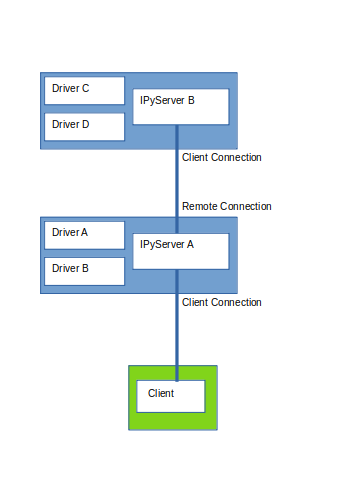

add_remote
==========

The IPyServer class has method add_remote which can make a connection to a remote INDI service and its drivers.

A typical layout might be:

In this scenario the client can control all the drivers, and any of the drivers can 'snoop' on any other.

However if the client connected to IPyServer B, it would not be able to communicate to Drivers A and B. The client to driver path should be in the client to server direction.

Great care must be taken not to introduce a network loop, otherwise traffic would circulate.
