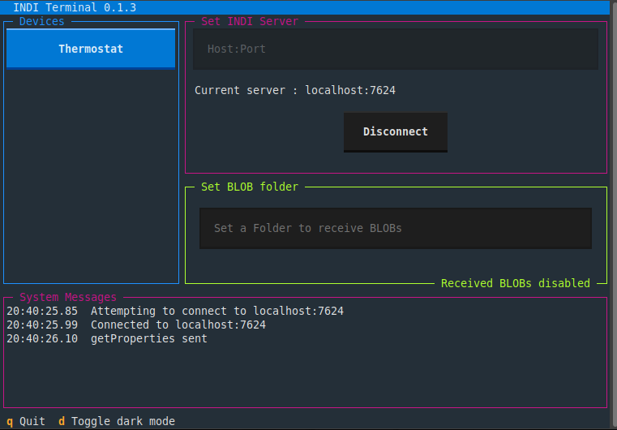
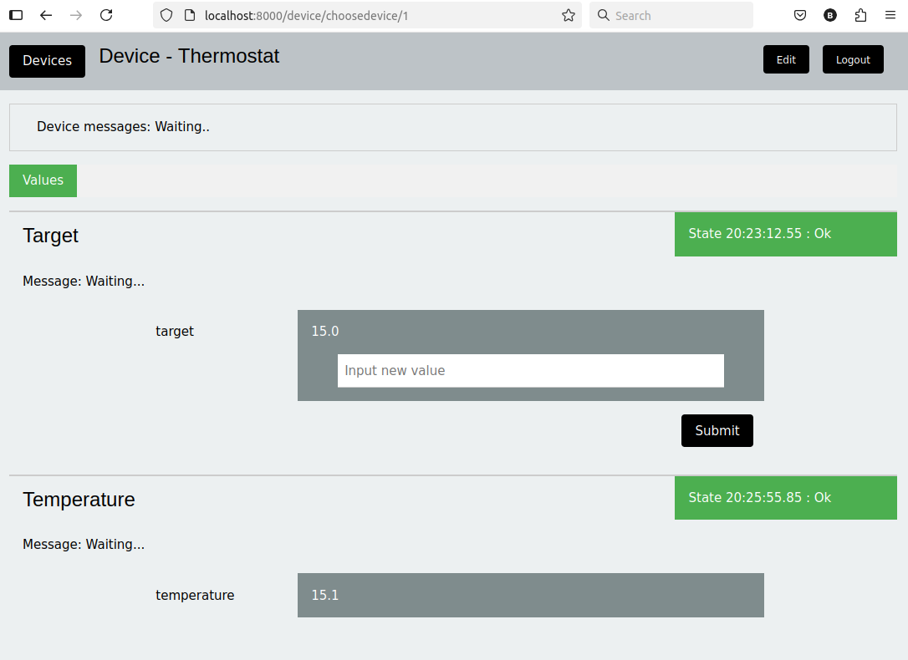

Concept
=======

The INDI protocol (Instrument Neutral Distributed Interface) specifies a limited number of ways data can be presented, as switches, lights, text, numbers and BLOBs (Binary Large Objects), together with grouping and label values which are used to display the data.

As the protocol contains the format of the data, a client learns and presents the controls when it connects.

This 'indipydriver' package provides classes which take values from your own code and serves the protocol, handling connections from clients. The package is pure Python and has no dependencies other than the standard library.

In general, a client transmits a 'getProperties' request, and this indipydriver responds to this with definition packets (defSwitchVector, defLightVector, .. ) that define the format of the instrument data.

As the instrument produces changing values, you would call the appropriate methods to send 'set' packets, such as setSwitchVector, setLightVector ..., which contain the new values, and which the client will receive.

The client can send 'new' packets to set new values to the instrument. The IPyDriver object has a rxevent method which is called as new properties are received, and which you can use to control your instrument.

A typical driver program will be structured as:

.. image:: ./images/concept.png

There are further facilities available; in which one driver can monitor (snoop) on the output of another driver, the server object can use third party drivers, and can also connect to remote servers and drivers, creating a network of instruments:

.. image:: ./images/rem2.png

Install indipydriver
====================

Generally you would install from Pypi into a virtual environment.

If you are trying this on a Raspberry pi, you may want to use your system gpiozero package. In which case, when creating the virtual environment, use the --system-site-packages option to allow your script to use system packages::

    python3 -m venv --system-site-packages my_env_directory

    source my_env_directory/bin/activate

    pip install indipydriver

If you are using the indipyserver package to serve this driver, you would also install::

    pip install indipyserver

First Example
^^^^^^^^^^^^^

The next page shows an example driver using the above structure, describing an LED control on a Raspberry Pi, see :ref:`firstexample`.

Clients
=======

To connect to the INDI service, and display the instrument properties you need a client. Clients could be written for a particular instrument, or could be general purpose, able to display any instrument. Two such are are shown below.

indipyterm
^^^^^^^^^^

The associated package indipyterm provides a terminal client, using the 'textual' library, and is also available from Pypi.

https://pypi.org/project/indipyterm

The client can be run from a virtual environment with

indipyterm [options]

or with

python3 -m indipyterm [options]

The package help is:

.. code-block:: text

    usage: indipyterm [options]

    Terminal client to communicate to an INDI service.

    options:
      -h, --help               show this help message and exit
      --port PORT              Port of the INDI server (default 7624).
      --host HOST              Hostname/IP of the INDI server (default localhost).
      --blobfolder BLOBFOLDER  Optional folder where BLOB's will be saved.

      --version    show program's version number and exit

A typical session would look like:

Further information about indipyterm can be found from:

https://github.com/bernie-skipole/indipyterm

indipyweb
^^^^^^^^^

The associated package indipyweb provides a client which serves web pages, and is also available from Pypi.

https://pypi.org/project/indipyweb

The client can be run from a virtual environment with

indipyweb [options]

or with

python3 -m indipyweb [options]

The package help is:

.. code-block:: text

    usage: indipyweb [options]

    Web server to communicate to an INDI service.

    options:
      -h, --help                   show this help message and exit
      --port PORT                  Listening port of the web server.
      --host HOST                  Hostname/IP of the web server.
      --dbfolder DBFOLDER          Folder where the database will be set.
      --securecookie SECURECOOKIE  Set True to enforce https only for cookies.
      --version                    show program's version number and exit

    The host and port set here have priority over values set in the database.
    If not given, and not set in the database, 'localhost:8000' is used.
    The database file holds user and INDI port configuration, and can be
    populated via browser using the 'edit' button.
    If it does not already exist, a database file will be created in the
    given db folder, or if not set, the current working directory will be used.
    A newly generated database file will contain a single default username
    and password 'admin' and 'password!'. These should be changed as soon as
    possible and the INDI host/port set (default localhost:7624).
    The securecookie argument is 'False' by default, if using a reverse
    proxy providing https connectivity, set securecookie to the string 'True'
    to ensure loggedin cookies can only pass over https.

A typical session would look like:

Further information about indipyweb can be found from:

https://github.com/bernie-skipole/indipyweb
