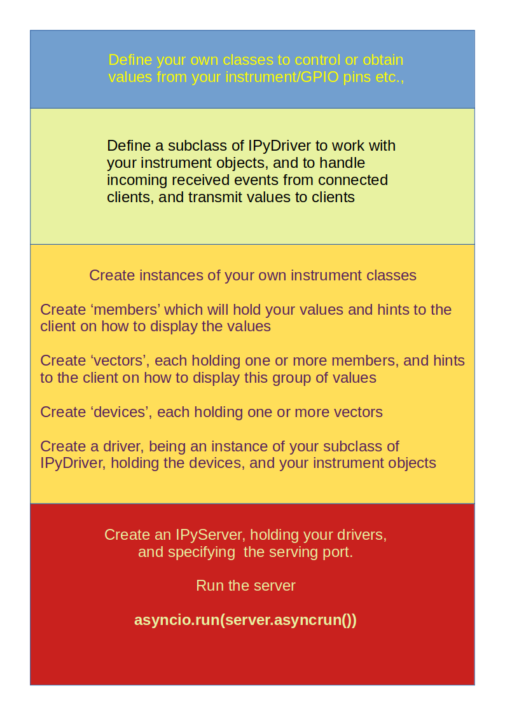
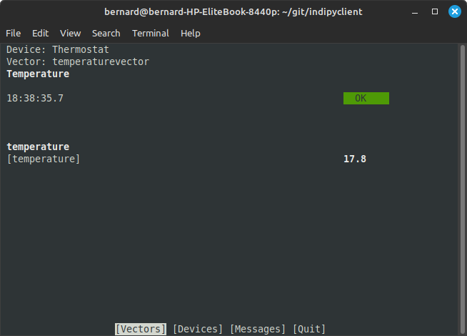

Concept
=======

The INDI protocol (Instrument Neutral Distributed Interface) specifies a limited number of ways data can be presented, as switches, lights, text, numbers and BLOBs (Binary Large Objects), together with grouping and label values which are used to display the data.

As the protocol contains the format of the data, a client learns and presents the controls when it connects.

This 'indipydriver' package provides classes which take values from your own code and serves the protocol, handling connections from clients.

In general, a client transmits a 'getProperties' request, and this indipydriver responds to this with definition packets (defSwitchVector, defLightVector, .. ) that define the format of the instrument data.

As the instrument produces changing values, you would call the appropriate methods to send 'set' packets, such as setSwitchVector, setLightVector ..., which contain the new values, and which the client will receive.

The client can send 'new' packets to set new values to the instrument. The IPyDriver object has a rxevent method which is called as new properties are received, and which you can use to control your instrument.

A typical driver program will be structured as:

There are further facilities available; in which one driver can monitor (snoop) on the output of another driver, the server object can use third party drivers, and can also connect to remote servers and drivers, creating a network of instruments:

.. image:: ./images/rem2.png

indipyclient
^^^^^^^^^^^^

The associated package indipyclient can be installed from Pypi.

https://pypi.org/project/indipyclient

This is a terminal client which communicates to an INDI service, and can be used to view and control your instruments.

The client can be run with

indipyclient [options]

or with

python3 -m indipyclient [options]

The package help is:

.. code-block:: text

    usage: indipyclient [options]

    Terminal client to communicate to an INDI service.

    options:
      -h, --help               show this help message and exit
      -p PORT, --port PORT     Port of the INDI server (default 7624).
      --host HOST              Hostname/IP of the INDI server (default localhost).
      -b BLOBS, --blobs BLOBS  Optional folder where BLOB's will be saved.
      --loglevel LOGLEVEL      Enables logging, value 1, 2, 3 or 4.
      --logfile LOGFILE        File where logs will be saved
      --version                show program's version number and exit

    The BLOB's folder can also be set from within the session.
    Setting loglevel and logfile should only be used for brief
    diagnostic purposes, the logfile could grow very big.
    loglevel:1 Information and error messages only,
    loglevel:2 As 1 plus xml vector tags without members or contents,
    loglevel:3 As 1 plus xml vectors and members - but not BLOB contents,
    loglevel:4 As 1 plus xml vectors and all contents

A typical session would look like:

As well as the terminal client, the indipyclient package can be imported into your own script and provides a set of classes which can generate the INDI protocol and create the connection to a port serving INDI drivers. This could be used to create your own client, or to control remote instruments with your own Python program.

Further information about indipyclient can be found from:

https://indipyclient.readthedocs.io
