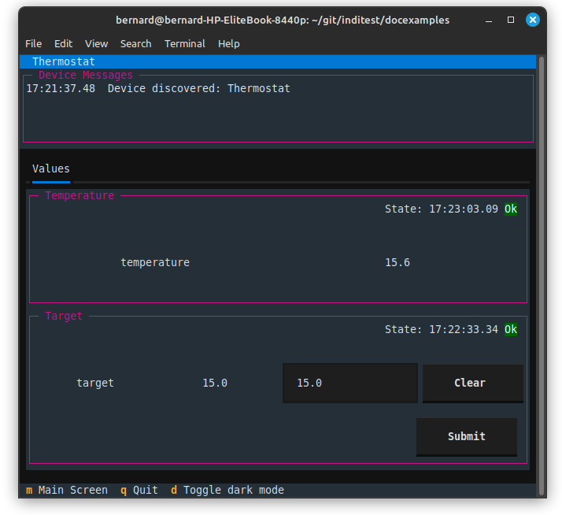

Example2
========

This example shows how the client can set a target temperature by sending
a 'newNumberVector', which causes the rxevent method to be called.

It expands on example1 by adding a further NumberVector and NumberMember, and
using the rxevent(self, event) method to accept the new target value::

    import asyncio

    import indipydriver as ipd

    class ThermalControl:
        """This is a simulation containing variables only, normally it
           would control a real heater, and take temperature measurements
           from a sensor."""

        def __init__(self, devicename, target=15):
            """Set start up values"""
            # It is useful to give this controlling object the devicename
            # reference, so it can be identified throughout the code
            self.devicename = devicename
            self.target = target
            self.temperature = 20
            self.heater = "Off"
            self.stop = False

        def shutdown(self):
            self.stop = True

        async def run_thermostat(self):
            """This simulates temperature increasing/decreasing, and turns
               on/off a heater if moving too far from the target."""
            while not self.stop:
                await asyncio.sleep(2)
                if self.heater == "On":
                    # increasing temperature if the heater is on
                    self.temperature += 0.1
                else:
                    # decreasing temperature if the heater is off
                    self.temperature -= 0.1

                if self.temperature > self.target+0.5:
                    # too hot
                    self.heater = "Off"

                if self.temperature < self.target-0.5:
                    # too cold
                    self.heater = "On"

    class ThermoDriver(ipd.IPyDriver):

        """IPyDriver is subclassed here, with a method
           to run the thermalcontrol.run_thermostat() method,
           accept a target temperature,
           and to transmit the temperature to the client"""

        async def rxevent(self, event):
            "On receiving data, this is called"

            thermalcontrol = self.driverdata["thermalcontrol"]
            devicename = thermalcontrol.devicename

            if event.devicename != devicename:
                # No other device data is expected, ignore anything
                # without the correct devicename
                return

            if isinstance(event, ipd.newNumberVector):
                if event.vectorname == "targetvector" and 'target' in event:
                    # Set the received value as the thermostat target

                    # The self.indi_number_to_float method converts the received string,
                    # which may be in a number of formats to a Python float value. This
                    # can then be set into thermalcontrol
                    try:
                        target = self.indi_number_to_float( event['target'] )
                    except TypeError:
                        # ignore an incoming invalid number
                        return
                    # set new target
                    thermalcontrol.target = target
                    # and set the new target value into the vector,
                    # then transmit the vector back to client.
                    event.vector['target'] = target
                    await event.vector.send_setVector()

        async def hardware(self):
            """This coroutine starts when the driver starts."""

            # get the object controlling the instrument, which is available
            # in the named arguments dictionary 'self.driverdata'.
            thermalcontrol = self.driverdata["thermalcontrol"]
            devicename = thermalcontrol.devicename

            # set the thermalcontrol instrument running
            controltask = asyncio.create_task(thermalcontrol.run_thermostat())

            vector = self[devicename]['temperaturevector']
            while not self.stop:
                await asyncio.sleep(10)
                # Send the temperature every 10 seconds
                vector['temperature'] = thermalcontrol.temperature
                # and transmit it to the client
                await vector.send_setVector()

            # the loop above has finished, so stop the controltask
            thermalcontrol.shutdown()
            # and wait for it to stop
            await controltask

    def make_driver(devicename, target):
        "Returns an instance of the driver"

        # Make an instance of the object controlling the instrument
        thermalcontrol = ThermalControl(devicename, target)

        # Make a NumberMember holding the temperature value
        temperature = ipd.NumberMember( name="temperature",
                                        format='%3.1f', min=-50, max=99,
                                        membervalue=thermalcontrol.temperature )
        # Make a NumberVector instance, containing the member.
        temperaturevector = ipd.NumberVector( name="temperaturevector",
                                              label="Temperature",
                                              group="Values",
                                              perm="ro",
                                              state="Ok",
                                              numbermembers=[temperature] )

        # create a NumberMember holding the target value
        target = ipd.NumberMember( name="target",
                                   format='%3.1f', min=-50, max=99,
                                   membervalue=thermalcontrol.target )
        targetvector = ipd.NumberVector( name="targetvector",
                                         label="Target",
                                         group="Values",
                                         perm="rw",
                                         state="Ok",
                                         numbermembers=[target] )

        # note the targetvector has permission rw so the client can set it

        # create a device with the two vectors
        thermostat = ipd.Device( devicename=devicename,
                                 properties=[temperaturevector, targetvector] )

        # Create the Driver which will contain this Device,
        # and the instrument controlling object
        driver = ThermoDriver( thermostat,
                               thermalcontrol=thermalcontrol )

        # and return the driver
        return driver

    if __name__ == "__main__":

        # create and serve the driver
        # the devicename has to be unique in a network of devices,
        # and this name and target could come from script arguments

        # in this case the devicename is "Thermostat", target 15

        # make a driver for the instrument
        thermodriver = make_driver("Thermostat", 15)
        # and a server, which serves this driver
        server = ipd.IPyServer(thermodriver)
        print(f"Running {__file__}")
        asyncio.run(server.asyncrun())

And the result, when connecting using indipyterm is:

