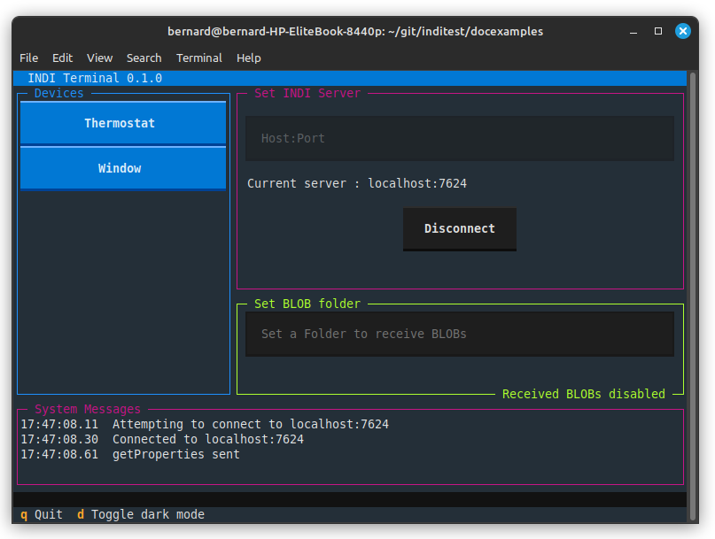
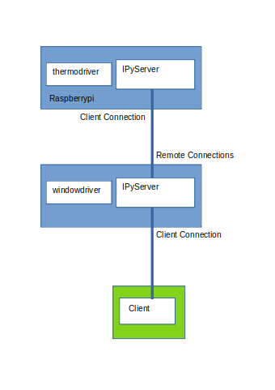

Example3
========

This example simulates a driver which snoops on the thermostat of the previous example, and if the temperature becomes too hot, it opens a window, and closes it when the temperature drops::

    import asyncio

    import indipydriver as ipd

    class WindowControl:
        "This is a simulation containing variables only"

        def __init__(self, devicename):
            "Set initial value of window"
            self.devicename = devicename
            self.window = "Open"
            # window should be "Open" or 'Closed'

        def set_window(self, temperature):
            """Gets new temperature, sets window accordingly"""
            if temperature > 21:
                self.window = "Open"
            if temperature < 18:
                self.window = "Closed"

    class _WindowDriver(ipd.IPyDriver):

        """IPyDriver is subclassed here"""

        async def hardware(self):
            "Update client with window status"

            windowcontrol = self.driverdata["windowcontrol"]
            devicename = windowcontrol.devicename
            statusvector = self[devicename]['windowstatus']

            snoopdevicename = self.driverdata["snoopdevicename"]

            # set snooping
            self.snoop(devicename=snoopdevicename, vectorname="temperaturevector")

            while not self._stop:
                # every ten seconds send an update on window position
                await asyncio.sleep(10)
                # get the current window status
                statusvector['status'] = windowcontrol.window
                # and transmit it to the client
                await statusvector.send_setVector(allvalues=False)
                # allvalues=False means that not all values will be sent, only
                # values that have changed, so this avoids unnecessary data
                # being transmitted

        async def snoopevent(self, event):
            """Handle receipt of an event from the Thermostat,
               and update the windowcontrol with the temperature"""
            windowcontrol = self.driverdata["windowcontrol"]
            snoopdevicename = self.driverdata["snoopdevicename"]

            if isinstance(event, ipd.setNumberVector):
                if event.devicename == snoopdevicename and event.vectorname == "temperaturevector" and "temperature" in event:
                    # A setNumberVector has been sent from the thermostat to the client
                    # and this driver has received a copy, and so can read the temperature
                    try:
                        temperature = self.indi_number_to_float(event["temperature"])
                    except TypeError:
                        # ignore an incoming invalid number
                        return
                    # this updates windowcontrol which opens or closes the widow
                    windowcontrol.set_window(temperature)

    def make_driver(devicename, snoopdevicename):
        "Creates the driver"

        # make the windowcontrol object
        windowcontrol = WindowControl(devicename)

        status = ipd.TextMember( name="status",
                                 label="Window position",
                                 membervalue=windowcontrol.window )
        windowstatus = ipd.TextVector( name="windowstatus",
                                       label="Window Status",
                                       group="Values",
                                       perm="ro",
                                       state="Ok",
                                       textmembers=[status] )
        # make a Device with this vector
        window = ipd.Device( devicename=devicename,
                             properties=[windowstatus] )

        # Make the WindowDriver containing this Device
        # the window controlling object, and the name of the thermostat
        windowdriver = _WindowDriver( window,
                                      windowcontrol=windowcontrol,
                                      snoopdevicename = snoopdevicename )

        # and return the driver
        return windowdriver

    # Assuming the thermostat example is example2.py, these two
    # drivers could be run by one server with:

    if __name__ == "__main__":

        import example2
        # make the thermostat driver
        thermodriver = example2.make_driver("Thermostat", 15)
        # make the window driver
        windowdriver = make_driver("Window", "Thermostat")

        server = ipd.IPyServer(thermodriver, windowdriver)
        print(f"Running {__file__}")
        asyncio.run( server.asyncrun() )

And using indipyterm you can see that both the Thermostat and Window devices have been discovered.

Alternatively if the thermostat of example2 was running on a remote machine (with name 'raspberrypi'), then this script could be altered to remotely connect to it.

Example2 would need one minor modification::

        server = ipd.IPyServer( thermodriver,
                                host="0.0.0.0",
                                port=7624,
                                maxconnections=5)

The server host has 'localhost' changed to "0.0.0.0" indicating it is listening on all IP addresses, allowing the window control machine to connect to it.

The machine operating the window could then be changed to::

    if __name__ == "__main__":

        # make the window driver
        windowdriver = make_driver("Window", "Thermostat")
        server = ipd.IPyServer(windowdriver)
        server.add_remote(host='raspberrypi', port=7624)
        print(f"Running {__file__}")
        asyncio.run(server.asyncrun())

The server.add_remote command enables this to make a connection to raspberrypi which is running the thermostat, and this connects the two. If indipyclient is then run on the machine running the windowdriver, it is able to control both drivers as before.
