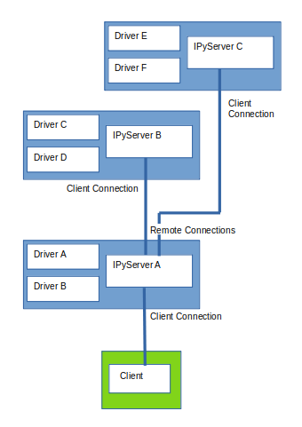

IPyServer
=========

This server class is used to run IPyDriver instances and can also run executable, possibly non-python, drivers written by other parties. It creates a listening INDI service. It provides the snooping ability between drivers, enables connections to other remote INDI servers so a branching tree network of drivers can be made, it implements enableBLOB instructions received from the client, and allows up to ten client connections.

If only executable drivers or remote servers are being used, and no IPyDriver instances are implemented, no drivers should be set.

.. autoclass:: indipydriver.IPyServer
   :members: asyncrun, add_remote, add_exdriver, send_message, shutdown

The server has attributes:

self.host - the host

self.port - the port

self.stop - This is set to True when the server.shutdown() method is called.

self.stopped - An asyncio.Event() object, await server.stopped.wait() will block until the server stops.

self.debug_enable - Default True, will enable server xml traffic to be logged, if logging is set at DEBUG level.

add_remote
^^^^^^^^^^

The IPyServer class has method add_remote which can make a connection to a remote INDI service and its drivers.

A typical layout might be:

.. image:: ./images/rem1.png

The device traffic is broadcast along all links, so a client connected to any server can control all devices, and any of the drivers can 'snoop' on any other.

Great care must be taken not to introduce a network loop, otherwise traffic would circulate.

Another layout might be:

In this case Driver E is 'Listening' on a port, rather than using IPyServer, this reduces the code involved in running the driver.

add_exdriver
^^^^^^^^^^^^

The IPyServer class has method add_exdriver which given an executable command, will run the given driver program, and communicate with it via stdnin, stdout and stderr.

This example shows two INDI drivers available from indilib.org and both being served.  No IPyDriver instances are passed into the IPyServer arguments here, however if required IPyDriver and executable drivers could all be served together::

    import asyncio

    from indipydriver import IPyServer

    server = IPyServer(host="localhost",
                       port=7624,
                       maxconnections=5)

    server.add_exdriver("indi_simulator_telescope")
    server.add_exdriver("indi_simulator_ccd")
    asyncio.run(server.asyncrun())

For further information regarding indilib.org see :ref:`references`.

Connecting using indipyclient gives:

