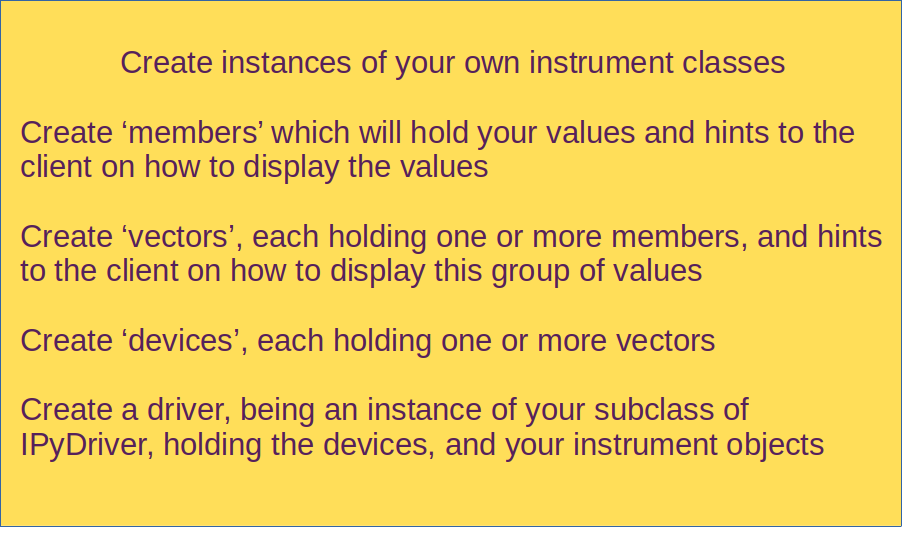
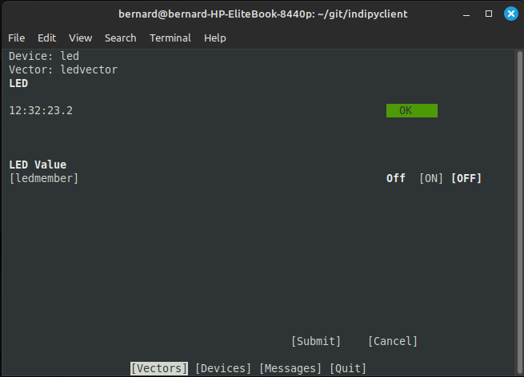

Summary
=======

The following summarises how a driver could be structured, describing an LED control on a Raspberry Pi.

Install indipydriver
^^^^^^^^^^^^^^^^^^^^

Generally you would install from Pypi into a virtual environment.

If you are trying this on a Raspberry pi, you may want to use your system gpiozero package. In which case, when creating the virtual environment, use the --system-site-packages option to allow your script to use system packages::

    python3 -m venv --system-site-packages my_env_directory

    source my_env_directory/bin/activate

    pip install indipydriver

Define your instrumentation objects
^^^^^^^^^^^^^^^^^^^^^^^^^^^^^^^^^^^

You would initially start the script by defining your own classes. In this example an LED will be controlled::

    import asyncio
    import indipydriver as ipd

    # from gpiozero import LED

    # If trying this on a raspberrypi, uncomment the line above
    # and comment out or delete this simulated LED class definition

    class LED:
        "A class to simulate gpiozero.LED"

        def __init__(self, pin):
            self.pin = pin
            self.is_lit = False

        def on(self):
            self.is_lit = True

        def off(self):
            self.is_lit = False

Subclass IPyDriver
^^^^^^^^^^^^^^^^^^

The IPyDriver class has signature::

    class IPyDriver(*devices, **driverdata)

Where 'devices' is one or more devices this driver will control, each device being an instance of the 'Device' class. In this example a single device will be created with devicename set to "led".

Keyword arguments set into 'driverdata' could contain any optional data you wish to set into the class, and which will then be available to your rxevent and hardware methods. In general this can be used to pass in your object which does the actual instrument control. In this example this feature is used to pass in an LED object.

A note on terminology here - a driver object can contain one or more devices, a device consists of one or more property 'vectors', where each vector object contains one or more members. A vector can be a 'Switch' vector, which may for example hold a number of switches which could define a radio button. Similarly a 'Text' vector holds text members, a 'Light' vector holds light members, a Numbers vector holds numbers and a BLOB vector holds Binary Large Objects.

A Device object will be created with name "led", and will contain a single switch vector with name "ledvector".

This switch vector will have a single member, with name "ledmember"

The class IPyDriver should be subclassed with your own 'rxevent(event)' coroutine method::

    class _LEDDriver(ipd.IPyDriver):

        """IPyDriver is subclassed here to create an LED driver."""

        async def rxevent(self, event):
            "On receiving data from the client, this is called"

            # get the LED object controlling the instrument, which is
            # available in the named arguments dictionary 'self.driverdata'

            ledobject = self.driverdata["ledobj"]

            # event.vector is the vector being requested or altered
            # event[membername] is the new value.

            # There is only one device in this driver,
            # so no need to check devicename

            if isinstance(event, ipd.newSwitchVector):
                if event.vectorname == "ledvector" and 'ledmember' in event:
                    # a new value has been received from the client
                    ledvalue = event["ledmember"]
                    # turn on or off the led
                    if ledvalue == "On":
                        ledobject.on()
                    elif ledvalue == "Off":
                        ledobject.off()
                    else:
                        # not valid
                        return
                    # and set this new value into the vector
                    event.vector["ledmember"] = ledvalue
                    # send the updated vector back to the client
                    await event.vector.send_setVector()

rxevent method
^^^^^^^^^^^^^^

The event object is triggered by data received from the client, and is one of "enableBLOB", "newSwitchVector", "newNumberVector", "newTextVector" or "newBLOBVector".

The enableBLOB event can be ignored - it is used internally by IPyServer.

The new vector events are sent by the client to change the instrument settings, in this case to switch on or off the LED. These events are mappings of membername to value which the client is submitting, not all membernames may be present if they are not being changed.

In this case the only event to be received will be a newSwitchVector for the devicename "led", and vectorname "ledvector" - as this is the only device and vector defined which can be controlled by the client.

The client is setting the member's value, 'On' or 'Off' which is obtained from event["ledmember"].::

    ledvalue = event["ledmember"]

Gets the value from the event, which is then used to set the LED.

You should then set the vector's member "ledmember" to the new value, and await the vector's send_setVector() method, which sends it to the client, confirming that the led has changed state.

A vector is a mapping to its member values, so::

    event.vector["ledmember"] = ledvalue

Sets the vector member with name "ledmember" to the new value, and::

    await event.vector.send_setVector()

Sends this new value to the client.

hardware method
^^^^^^^^^^^^^^^

In the example above no hardware coroutine is needed, but there may be instruments that need to send data periodically. The hardware coroutine is automatically started and normally runs continuously, typically with a 'while not self.stop' loop. (self.stop is an attribute set to True if shutdown() is called on a driver). Examples are given further in this documentation.

The driver is a mapping to its devices, so self["led"] will get the device with devicename "led", and a device is a mapping to its vectors, so self["led"]["ledvector"] will return the vector controlling the LED.

This vector, with updated member value can then be sent to the client using the vector's send_setVector() coroutine method at regular intervals.

Make the driver
^^^^^^^^^^^^^^^

The driver, device, vectors etc,. have to be instantiated, it is suggested this is done in a make_driver() function::

    def make_driver(devicename, pin):
        "Creates the driver"

        # Note that “is_lit” is a property of the LED object
        # and is True if the LED is on, this is used to
        # set up the initial value of ledmember.

        ledobject = LED(pin)
        ledvalue = "On" if ledobject.is_lit else "Off"

        # create switch member
        ledmember = ipd.SwitchMember(name="ledmember",
                                     label="LED Value",
                                     membervalue=ledvalue)
        # set this member into a vector
        ledvector = ipd.SwitchVector(name="ledvector",
                                     label="LED",
                                     group="Control Group",
                                     perm="wo",
                                     rule='AtMostOne',
                                     state="Ok",
                                     switchmembers=[ledmember] )
        # create a Device with this vector
        leddevice = ipd.Device( devicename, properties=[ledvector])

        # Create the Driver containing this device, and as named argument
        # add the LED object used for instrument control
        driver = _LEDDriver(leddevice, ledobj=ledobject )

        # and return the driver
        return driver

The various vector and member classes and their arguments are detailed further in this documentation.

Run the driver
^^^^^^^^^^^^^^

To run the driver include::

    if __name__ == "__main__":

        # set up the LED pin and create and serve the driver
        # the devicename has to be unique in a network of devices,
        # and this name and pin could come from script arguments

        # in this case the devicename is "led", pin 17
        driver = make_driver("led", 17)
        server = ipd.IPyServer(driver, host="localhost", port=7624, maxconnections=5)
        print(f"Running {__file__}")
        asyncio.run(server.asyncrun())

If the host, port and maxconnections are not specified in the IPyServer call, the values shown above are the defaults.

The IPyServer class takes drivers, only one in this example, and serves them all on the host/port. It allows connections from multiple clients. If more than one driver is to be served, the call would be::

    server = ipd.IPyServer(driver1, driver2, driver3,...., host="localhost", port=7624, maxconnections=5)

To run third party INDI drivers created with other languages or tools, the server object has an add_exdriver method, which given an executable will run it, and will communicate to it by stdin and stdout. The method can be called multiple times to add several executable drivers.

It also has an add_remote method which can be used to add connections to remote servers, creating a tree network of servers.

Connecting using the indipyclient terminal client gives:

The next few pages of this documentation list the classes describing property vectors and members, if you wish to skip to further examples, see :ref:`example1`.
