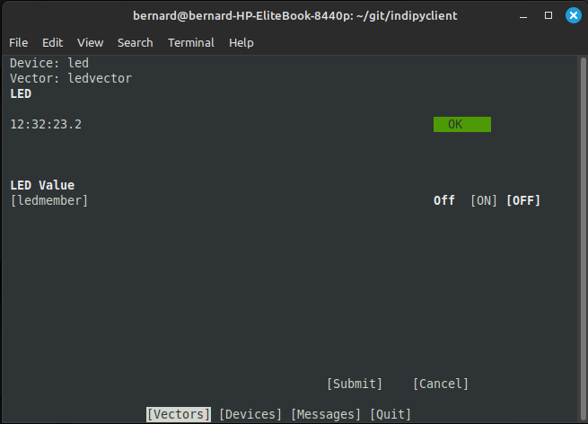

Summary
=======

The following summarises how a driver could be structured, describing a simulated LED control.

Subclass IPyDriver
^^^^^^^^^^^^^^^^^^

The IPyDriver class has signature::

    class IPyDriver(devices, tasks=[], **driverdata)

Where 'devices' is a list of devices this driver will control, each device being an instance of the 'Device' class. In this example a single device will be created with devicename set to "led".

The argument 'tasks' is a list of co-routines that you may have created to operate your instruments (to poll instrument values perhaps), the co-routines set in this list will all be started when the driver is run. This example does not use this functionality so tasks remains an empty list.

A note on terminology here - a driver object can contain one or more devices, a device consists of one or more property 'vectors', where each vector object contains one or more members. A vector can be a 'Switch' vector, which may for example hold a number of switches which could define a radio button. Similarly a 'Text' vector holds text members, a 'Light' vector holds light members, a Numbers vector holds numbers and a BLOB vector holds Binary Large Objects.

In this example the device object will contain a single switch vector, with a single switch member, to control the LED.

The keyword argument 'driverdata' contains any data you wish to set into the class, in this example it is not used.

The class IPyDriver should be subclassed with your own 'rxevent(event)' coroutine method::

    import asyncio
    import indipydriver as ipd

    # Simulates an LED with a simple global variable

    LED = 'Off'

    class LEDDriver(ipd.IPyDriver):

        """IPyDriver is subclassed here."""

        async def rxevent(self, event):
            "On receiving data from the client, this is called"
            global LED

            match event:

                # event.vector is the vector being requested or altered
                # event[membername] is the new value

                case ipd.getProperties():
                    # An event of type 'getProperties' is a client request
                    # to define a property. Send back a property definition
                    await event.vector.send_defVector()

                case ipd.newSwitchVector(devicename="led",
                                         vectorname="ledvector") if 'ledmember' in event:
                    # a new value has been received from the client
                    LED = event["ledmember"]
                    # and set this new value into the vector
                    event.vector["ledmember"] = LED
                    # send the updated vector back to the client
                    await event.vector.send_setVector()

rxevent method
^^^^^^^^^^^^^^

The event object is triggered by data received from the client, and is one of "enableBLOB", "getProperties", "newSwitchVector", "newNumberVector", "newTextVector" or "newBLOBVector".

The enableBLOB event can be ignored - it is used internally by IpyServer.

The getProperties event is sent by the client to discover the properties of the driver, and the reply you should generally use is shown above. The event has a 'vector' attribute, which is the vector being requested, and its send_defVector() method will transmit its definition back to the client.

The new vector events are sent by the client to change the instrument settings, in this case to switch on or off the LED. These events are mappings of membername to value which the client is submitting, not all membernames may be present if they are not being changed.

In this case the only event to be received will be a newSwitchVector for the devicename "led", and vectorname "ledvector" - as this is the only device and vector defined which can be controlled by the client. If any other device or vector event is received, it can be ignored.

The client is setting the member's value, 'On' or 'Off' which is obtained from event["ledmember"]. In this example 'LED' is a global variable which simulates your hardware that does the change, and so::

    LED = event["ledmember"]

Gets the value from the event, and sets the LED.

You should then set the vector's member "ledmember" to the new value, and await the vector's send_setVector() method, which sends it to the client, confirming that the led has changed state.

A vector is a mapping to its member values, so::

    event.vector["ledmember"] = LED

Sets the vector member with name "ledmember" to the new value, and::

    await event.vector.send_setVector()

Sends this new value to the client.

hardware method
^^^^^^^^^^^^^^^

In the example above no hardware coroutine is needed, but there may be instruments that need to send data periodically. The hardware coroutine is automatically started and should run continuously, typically with a 'while True' loop. Examples are given further in this documentation.

The driver is a mapping to its devices, so self["led"] will get the device with devicename "led", and a device is a mapping to its vectors, so self["led"]["ledvector"] will return the vector controlling the LED.

This vector, with updated member value can then be sent to the client using the vector's send_setVector() coroutine method at regular intervals.

Make the driver
^^^^^^^^^^^^^^^

The driver, device, vectors etc,. have to be instantiated, it is suggested this is done in a make_driver() function::

    def make_driver():
        "Creates the driver"

        # create switch member
        ledmember = ipd.SwitchMember(name="ledmember",
                                     label="LED Value",
                                     membervalue=LED)
        # set this member into a vector
        ledvector = ipd.SwitchVector(name="ledvector",
                                     label="LED",
                                     group="Control Group",
                                     perm="rw",
                                     rule='AtMostOne',
                                     state="Ok",
                                     switchmembers=[ledmember] )
        # create a Device with this vector
        led = ipd.Device( devicename="led", properties=[ledvector])

        # Create the Driver containing this device
        driver = LEDDriver(devices=[led])

        # and return the driver
        return driver

The various vector and member classes and their arguments are detailed further in this documentation.

Run the driver
^^^^^^^^^^^^^^

To run the driver include::

    if __name__ == "__main__":

        driver = make_driver()
        server = ipd.IPyServer([driver], host="localhost", port=7624, maxconnections=5)
        asyncio.run(server.asyncrun())

If the host, port and maxconnections are not specified in the IPyServer call, the values shown above are the defaults.

The IPyServer class takes a list of drivers, only one in this example, and serves them all on the host/port. It allows connections from multiple clients. The drivers must all be created from IPyDriver subclasses - this is not a general purpose server able to run third party INDI drivers created with other languages or tools.

Connecting using the indipyclient terminal client gives:

The next few pages of this documentation list the classes describing property vectors and members, if you wish to skip to further examples, see :ref:`example1`.
